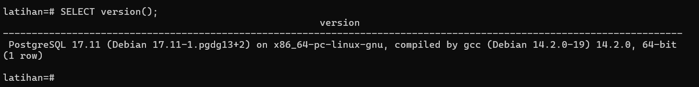
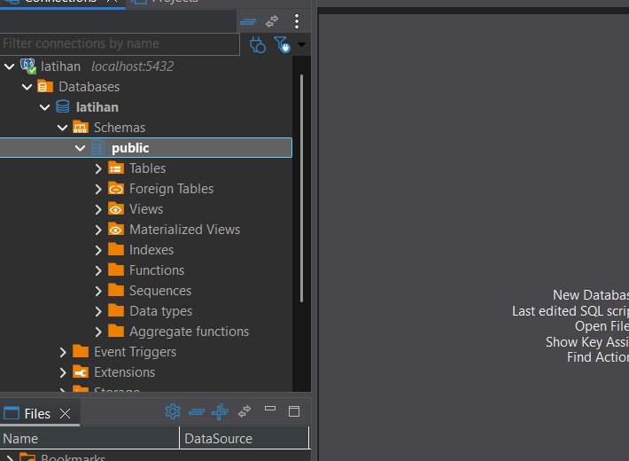
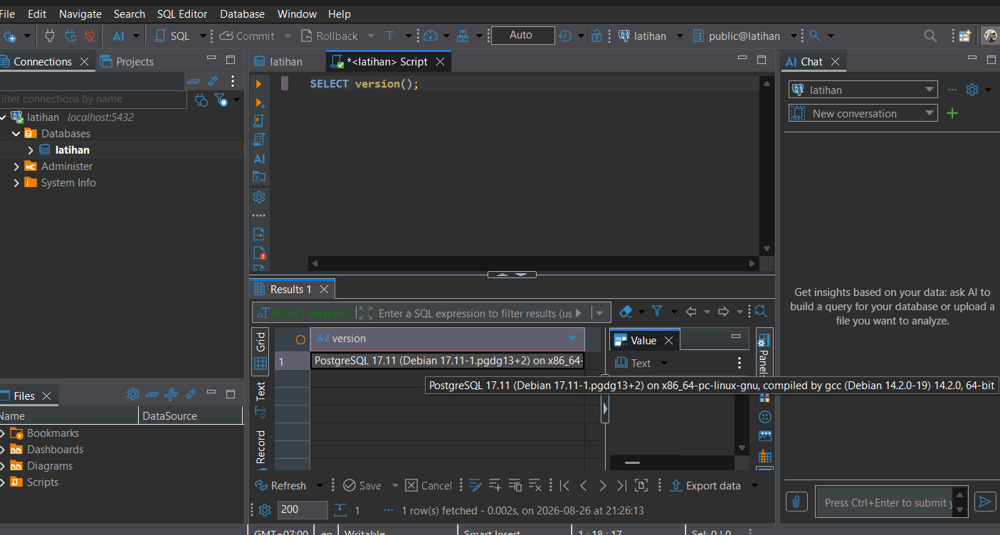

# Laporan Praktikum P01

## 1. Verifikasi Docker & Docker Compose
* **Keluaran docker --version:**


* **Keluaran docker compose version:**


## 2. Verifikasi Database

## 3. Pertanyaan Pemahaman (Image, Container, dan Volume)
1. **Docker Image:** Template atau blueprint yang berisi instruksi lengkap tapi masih bersifat read-only.
2. **Container:** Wujud nyata atau aplikasi yang lagi berjalan (runtime) dari sebuah Docker Image.
3. **Volume:** Media penyimpanan data khusus yang dibuat supaya data tetap aman dan persisten (menetap) walaupun containernya dihapus atau dimatikan.


## 4. Uji Koneksi PostgreSQL melalui CLI (psql)


### Langkah-langkah:
1. Membuka Terminal atau PowerShell.
2. Memastikan container PostgreSQL telah berjalan.
3. Menjalankan perintah berikut untuk masuk ke database PostgreSQL:

```bash
docker compose exec postgres psql -U msbd -d latihan
```

## 5. Pemeriksaan Versi PostgreSQL melalui CLI (psql)



### Langkah-langkah:
1. Membuka Terminal atau PowerShell.
2. Masuk ke PostgreSQL menggunakan perintah:

```bash
docker compose exec postgres psql -U msbd -d latihan
```

## 6. Uji Koneksi PostgreSQL melalui DBeaver



### Langkah-langkah:
1. Membuka aplikasi **DBeaver Community Edition**.
2. Memilih menu **New Database Connection** untuk membuat koneksi baru.
3. Memilih **PostgreSQL** sebagai jenis database.
4. Mengisi konfigurasi koneksi sebagai berikut:

| Parameter | Nilai |
|---|---|
| Host | `localhost` |
| Port | `5432` |
| Database | `latihan` |
| Username | `msbd` |

5. Memasukkan password PostgreSQL sesuai dengan konfigurasi Docker Compose.
6. Memilih **Test Connection** untuk menguji koneksi.
7. Setelah koneksi berhasil, memilih **Finish**.
8. Membuka koneksi database `latihan` pada bagian **Database Navigator**.
9. Membuka bagian **Schemas**.
10. Membuka schema `public` untuk melihat objek database.

### Hasil:
Koneksi PostgreSQL melalui DBeaver berhasil dilakukan. Database `latihan` dapat diakses menggunakan host `localhost` dan port `5432`.

Schema `public` juga berhasil ditampilkan pada DBeaver. Pada tahap ini bagian `Tables` masih kosong karena database `latihan` belum memiliki tabel.

Keberhasilan koneksi ini menunjukkan bahwa DBeaver dapat berkomunikasi dengan PostgreSQL yang berjalan di dalam Docker.

## 7. Menjalankan Query PostgreSQL melalui DBeaver



### Langkah-langkah:
1. Membuka aplikasi **DBeaver Community Edition**.
2. Memilih koneksi database `latihan` yang sebelumnya telah dibuat.
3. Membuka **SQL Editor** pada koneksi PostgreSQL.
4. Menuliskan query berikut:

```sql
SELECT version();
```

## 8. Perbandingan Penggunaan psql dan DBeaver

### 8.1 Aktivitas yang Lebih Cepat Menggunakan psql

Menurut saya, aktivitas yang lebih cepat dilakukan menggunakan `psql` adalah menjalankan perintah atau query SQL secara langsung melalui terminal. Dengan `psql`, saya dapat langsung mengetik perintah tanpa harus membuka atau memilih menu pada antarmuka grafis.

Contohnya adalah ketika melakukan pengecekan database menggunakan perintah:

```text
\l
\dt
\dn
\du
```
