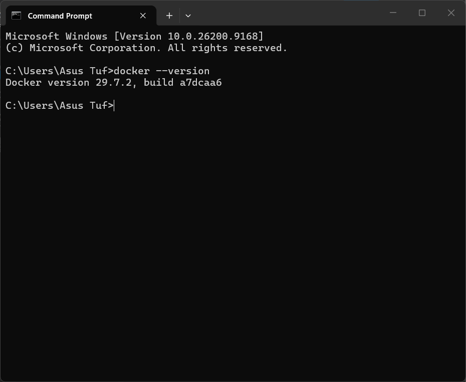
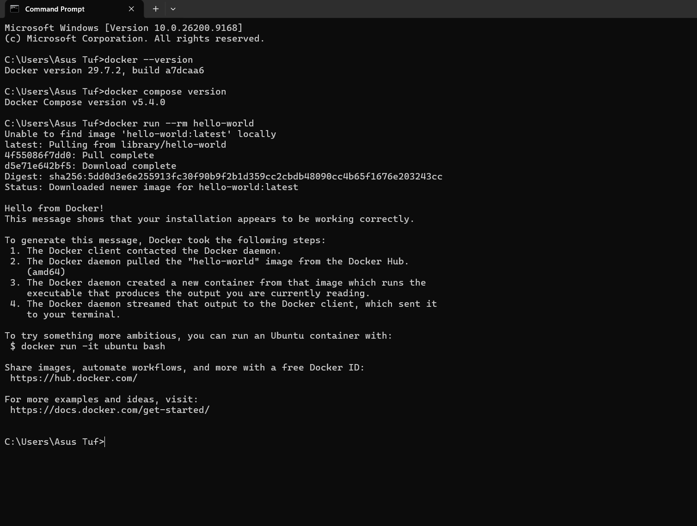
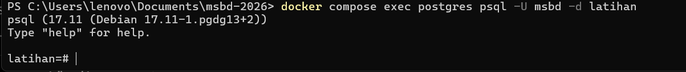

# Laporan Praktikum P01

## 1. Verifikasi Docker & Docker Compose
* **Keluaran docker --version:**


* **Keluaran docker compose version:**


## 2. Pertanyaan Pemahaman (Image, Container, dan Volume)
1. **Docker Image:** Template atau blueprint yang berisi instruksi lengkap tapi masih bersifat read-only.
2. **Container:** Wujud nyata atau aplikasi yang lagi berjalan (runtime) dari sebuah Docker Image.
3. **Volume:** Media penyimpanan data khusus yang dibuat supaya data tetap aman dan persisten (menetap) walaupun containernya dihapus atau dimatikan.

---

## 3. Pertanyaan Langkah 2 (Menyusun dan Menjalankan Docker Compose)
**[TUGAS RIZAL: Jawab 4 pertanyaan di bawah ini]**
1. **Apa yang terjadi jika bagian `volumes:` pada layanan PostgreSQL dihapus, kemudian container dihentikan menggunakan `docker compose down -v`?**
   * [ISI JAWABANMU DI SINI]
2. **Mengapa pemetaan port ditulis "5432:5432" dan bukan cukup satu angka? Apa yang harus diubah apabila komputer Anda sudah memiliki PostgreSQL lain yang menggunakan port 5432?**
   * [ISI JAWABANMU DI SINI]
3. **Apa fungsi blok healthcheck? Mengapa healthcheck penting ketika terdapat layanan lain yang bergantung pada basis data?**
   * [ISI JAWABANMU DI SINI]
4. **Menyimpan password langsung di dalam `docker-compose.yml` merupakan praktik yang kurang baik. Sebutkan satu cara yang lebih aman dan jelaskan mengapa hal tersebut penting ketika berkas masuk ke repositori Git.**
   * [ISI JAWABANMU DI SINI]

---

## 4. Uji Koneksi PostgreSQL melalui CLI (psql)


### Langkah-langkah:
1. Membuka Terminal atau PowerShell.
2. Memastikan container PostgreSQL telah berjalan.
3. Menjalankan perintah berikut untuk masuk ke database PostgreSQL:
```bash
docker compose exec postgres psql -U msbd -d latihan