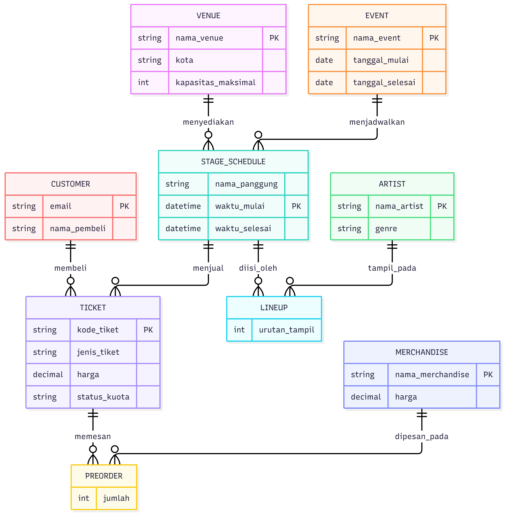

## 1. a. Domain yang dipilih:
Sistem Manajemen Festival Musik
## 1. b. Alasan pengambilan domain tersebut:
Pemilihan domain ini didasari oleh kebutuhan untuk mengeksplorasi kompleksitas pengelolaan basis data pada industri hiburan skala besar yang menawarkan tantangan logika relasional lebih dinamis dibandingkan sistem konversional. Sistem ini dirancang untuk memahami arsitektur data platform tiket profesional, khususnya dalam menangani validasi aturan bisnis yang kompleks seperti pencegahan konflik jadwal panggung (conflict scheduling), pengelolaan kuota venue, penyesuaian harga tiket dinamis (early-bird), serta transaksi merchandise pre-order yang terikat pada data tiket.

## 2. Ringkasan lingkup sistem.
Sistem Manajemen Festival Musik dirancang untuk mengelola seluruh siklus operasional acara musik secara terpusat. Lingkup utamanya mencakup pencatatan data induk mulai dari venue, artis, hingga event konser itu sendiri. Sistem juga mengakomodasi relasi kompleks seperti Lineup artis dan pemesanan merchandise pre-order yang terikat dengan tiket pembeli. Di sisi fungsional, sistem berfokus pada validasi logika bisnis yang ketat, meliputi pencegahan jadwal panggung yang tumpang tindih (conflict scheduling prevention) secara otomatis, pengendalian kuota kapasitas venue terhadap tiket yang terjual, serta penyesuaian harga tiket dinamis berdasarkan status kuota early-bird. Sebaliknya, sistem ini tidak mencakup hal-hal yang bersifat eksternal atau fisik murni, seperti integrasi langsung dengan payment gateway perbankan, proses logistik pengiriman kurir untuk merchandise, pembuatan kontrak kerja sama artis, maupun pengelolaan internaal panitia acara.

## 3. Ringkasan kebutuhan data yang dibuat.
Sistem ini merumuskan 10 Kebutuhan Data (KD-01 hingga KD-10) yang terbagi menjadi 2 kategori utama. Kelompok inti mencakup pengelolaan data entitas dasar (Venue, Artist, Event, Customer), serta data operasional kruisal seperti Lineup Artis, Stage_Schedule untuk pencegahan jadwal bentrok, Transaksi Tickte, dan Validasi Kapasitas. Sementara itu, kelompok pendukung berfokus pada fitur komersial melalui Manajemen Merchandise dan Pemesanan Merchandise Pre-Order. Seluruh kebutuhan ini dirancang terintegrasi untuk menjaga integritas data dan mengotomatisasi aturan bisnis yang kompleks.

## 4. Penjelasan singkat ERD.

ERD konseptual sistem ini terdiri dari 7 entitas utama beserta 2 entitas asosiatif untuk menguraikan relasi many-to-many, sehingga total terdapat 9 entitas.

**Entitas utama:**
- **Venue** — menyimpan data lokasi/panggung, meliputi nama venue, kota, dan kapasitas maksimal.
- **Artist** — menyimpan data pengisi acara, meliputi nama artist dan genre.
- **Event** — menyimpan data konser atau festival, meliputi nama event, tanggal mulai, dan tanggal selesai.
- **Stage_Schedule** — menyimpan jadwal tampil di suatu panggung, meliputi nama panggung, waktu mulai, dan waktu selesai. Entitas ini menjadi penghubung antara Event dan Venue, sehingga satu event dapat memiliki banyak jadwal panggung yang tersebar di venue berbeda.
- **Customer** — menyimpan data pembeli tiket, meliputi email dan nama pembeli.
- **Ticket** — menyimpan detail tiket yang dibeli, meliputi kode tiket, jenis tiket, harga, dan status kuota.
- **Merchandise** — menyimpan data atribut/produk yang dijual, meliputi nama merchandise dan harga.

**Entitas asosiatif (relasi many-to-many):**
- **Lineup** — menghubungkan Artist dengan Stage_Schedule, karena satu artis bisa tampil di banyak jadwal panggung berbeda, dan satu jadwal panggung bisa diisi oleh lebih dari satu artis (misalnya kolaborasi). Entitas ini menyimpan atribut urutan tampil.
- **PreOrder** — menghubungkan Ticket dengan Merchandise, karena satu tiket bisa dipakai untuk memesan berbagai jenis merchandise, dan satu jenis merchandise bisa dipesan lewat banyak tiket berbeda. Entitas ini menyimpan atribut jumlah pesanan.

**Relasi dan kardinalitas:**
- Event 1 — N Stage_Schedule (satu event dapat memiliki banyak jadwal panggung)
- Venue 1 — N Stage_Schedule (satu venue dapat menyediakan banyak jadwal panggung, lintas event)
- Stage_Schedule 1 — N Lineup, Artist 1 — N Lineup (relasi M:N antara Artist dan Stage_Schedule diuraikan melalui Lineup)
- Stage_Schedule 1 — N Ticket (tiket terikat pada jadwal panggung tertentu, bukan langsung ke event, agar validasi kuota kapasitas dapat dihitung per kombinasi venue dan event sesuai aturan bisnis Dynamic Ticket Quota)
- Customer 1 — N Ticket (satu customer dapat membeli banyak tiket)
- Ticket 1 — N PreOrder, Merchandise 1 — N PreOrder (relasi M:N antara Ticket dan Merchandise diuraikan melalui PreOrder)

Keputusan desain penting yang diambil kelompok adalah menghubungkan **Ticket ke Stage_Schedule**, bukan langsung ke Event. Hal ini didasari oleh aturan bisnis bahwa kapasitas kuota dihitung berdasarkan kombinasi Venue dan Event tertentu, bukan Event secara keseluruhan — sehingga satu event yang berlangsung di beberapa panggung/venue dapat memiliki kuota tiket yang divalidasi secara terpisah per panggung.

## 5. Keluaran atau ringkasan status migration.

## 6. Bukti database dapat dibangun ulang menggunakan migration.

## 7. Bukti pola 3 langkah penambahan kolom NOT NULL.

## 8. Hasil seed data setelah dijalankan 2 kali.

## 9. Pengamatan dari pg_stat_activity.

## 10. Jawaban pertanyaan 1-7:
1. Lingkungan pengujian memerlukan basis data terpisah untuk mengisolasi data uji dari lingkungan produksi agar manipulasi atau kesalahan data tidak merusak data utama. Selain itu, pemisahan ini memastikan konfigurasi, hak akses, dan siklus penghapusan data dapat dikelola secara independen tanpa risiko saling mengganggu.
2. Dari 10 Kebutuhan data, kami mengambil KD-05 Jadwal Panggung (Stage_Schedule) dan Aturan jadwal bentrok ini paling cocok pakai Trigger. Alasannya, kalau cuma pakai constraint bawaan SQL kayak CHECK atau UNIQUE, database nggak bakal sanggup ngecek irisan jam tampil yang tumpang tindih antar-baris secara otomatis. Di sisi lain, kalau cuma diatur lewat kode aplikasi, data gampang banget kena race condition atau bobol kalau sewaktu-waktu ada yang akses database langsung di luar aplikasi. Jadi, trigger adalah pilihan paling aman karena sistem bakal otomatis ngecek dan nolak jadwal yang bentrok langsung di dalam database sebelum datanya sempat kesimpan.
3. Satu transaksi peminjaman biasanya berisi lebih dari satu unit alat sekaligus (misalnya meminjam 3 unit dalam satu kali transaksi), dan satu unit alat bisa dipinjam berkali-kali pada peminjaman yang berbeda-beda. Ini adalah relasi many-to-many, yang tidak bisa direpresentasikan langsung antara dua entitas — harus diuraikan menjadi entitas asosiatif. Jika Peminjaman dan Unit Alat dihubungkan langsung (misalnya lewat foreign key tunggal), maka satu baris peminjaman hanya bisa mencatat satu unit alat saja, sehingga informasi "unit apa saja yang dipinjam dalam satu transaksi" akan hilang. Baris_Pinjam menyimpan detail per unit di dalam satu transaksi peminjaman, termasuk kemungkinan atribut tambahan seperti kondisi alat saat dipinjam per unit.
4. Alat merepresentasikan jenis atau model alat secara umum (misalnya "Multimeter Digital"), sedangkan Unit_Alat merepresentasikan satu instance fisik dari jenis alat tersebut (misalnya unit dengan nomor seri tertentu, yang punya kondisi dan status sendiri — bisa dipinjam, sedang diperbaiki, atau tersedia). Satu Alat bisa memiliki banyak Unit_Alat.   Pemisahan ini penting karena kalau digabung, sistem tidak bisa membedakan antara "berapa jenis alat yang kami punya" dengan "berapa unit fisik yang tersedia untuk dipinjam saat ini". Contoh pertanyaan bisnis yang hanya bisa dijawab jika dipisah: "Berapa unit Multimeter Digital yang sedang dalam perbaikan saat ini, dari total unit yang kami miliki?" — pertanyaan ini butuh menghitung status per unit fisik (Unit_Alat.status), bukan sekadar mengetahui bahwa jenis alat "Multimeter Digital" itu ada.
5. Flyway akan menghasilkan *error* `Checksum mismatch` dan menolak menjalankan migrasi apa pun. 
*   **Penyebab:** Flyway menghitung nilai *checksum* (hash) dari setiap file migrasi saat dieksekusi dan menyimpannya di database. Karena file V1 diubah, checksum file lokal tidak lagi cocok dengan checksum di database. Ini adalah mekanisme Flyway untuk mencegah inkonsistensi skema.
*   **Cara memperbaiki:** Anggota yang mengalami error harus menjalankan perintah `flyway repair` (via Docker: `docker compose run --rm flyway repair`). Perintah ini akan menyelaraskan ulang nilai checksum di database agar sama dengan file lokal yang baru, tanpa menghapus riwayat yang sudah ada.
6. *   **Apa yang terlihat:** Terdapat antrean proses. Transaksi dari Terminal 1 berstatus `idle in transaction` (menahan kunci), sementara query dari Terminal 2 memiliki `wait_event_type` berupa `Lock` dengan `state` berstatus `active` (menunggu).
*   **Perintah yang menunggu:** Perintah DDL `ALTER TABLE peminjaman...` dari Terminal 2.
*   **Akibat pada sistem produksi:** Terjadi efek *Lock Stampede*. Perintah `ALTER TABLE` membutuhkan *Access Exclusive Lock* sehingga harus antre di belakang Terminal 1. Bahayanya, setiap query pengguna lain yang masuk *setelah* `ALTER TABLE` tersebut juga akan ikut dipaksa mengantre. Akibatnya sistem akan macet (*hang*), koneksi menumpuk, dan aplikasi bisa *down* sampai transaksi awal di-commit/rollback.
7. Seed data tidak diletakkan di dalam migrations karena migrations berfokus pada perubahan struktur skema basis data secara bertahap (seperti membuat tabel atau kolom), sedangkan seed data berfokus pada pengisian data awal atau data dummy untuk keperluan operasional maupun pengujian.
Perbedaan sifat utamanya adalah sifat perubahan data: migration bersifat struktural, kronologis, dan permanen untuk membangun ulang bentuk database, sedangkan seed data bersifat opsional, fleksibel, dan fokus pada isi data yang dapat diubah atau dihapus ulang tanpa memengaruhi struktur tabel.

## 11. Daftar kontribusi atau commit masing2 anggota kelompok.
1. Andika Chairul Ilham - 
2. Fahri Arizal -
3. Fitya Shofi Ahmad - 
4. Mar'ie Rizqullah - 
